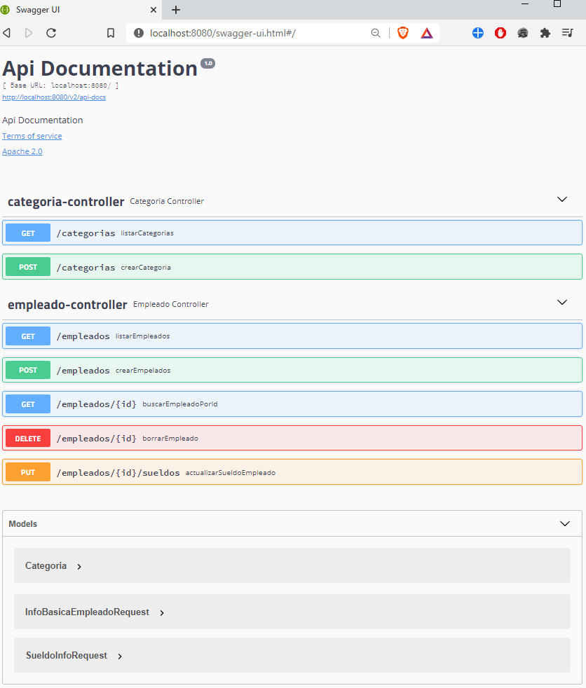

# rrhhEmpresa
## 📌WEB API
* Utilizando: Springboot
* Deployado: Heroku ➡️ https://sistema-rrhh.herokuapp.com/ (se utilizo POSTGRE para base de datos ya que es de manera gratuita) 
* Base de datos: MYSQL


**Sistema de gestion de empleados en donde podemos:**


🔷Empleados:
```
 POST ("/empleados") ---> Crear nuevo empleado
 ```
 ```
 GET("/empleados") ---> Obtener lista de empleados.
 ```
 ```
 GET("/empleados/{id}")---> Obtener empleado por ID.
 ```
 ```
 PUT("/empleados/{id}/sueldos") ---> Actualizar sueldo del empleado utilizando empleado ID.
 ```
 ```
 DELETE("/empleados/{id}") ---> Dar de baja empleado utilizando empleado ID.
 ```
 
🔷Categorias:
```
 POST("/categorias") --> Crear nuevas categorias
 ```
 ```
 GET("/categorias")  -->Obtener categorias
 ```
 
 
 
 🔷Swagger Doc Added 
 
  
